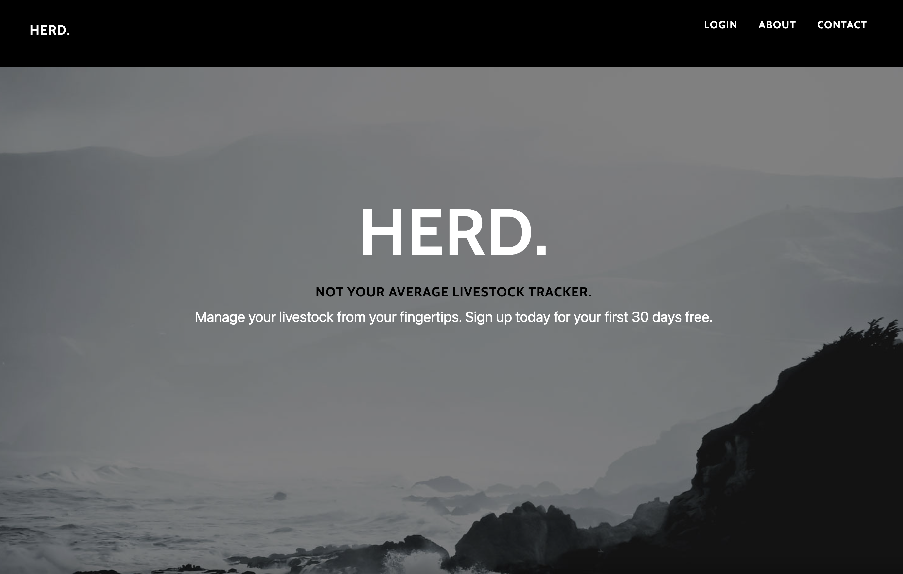
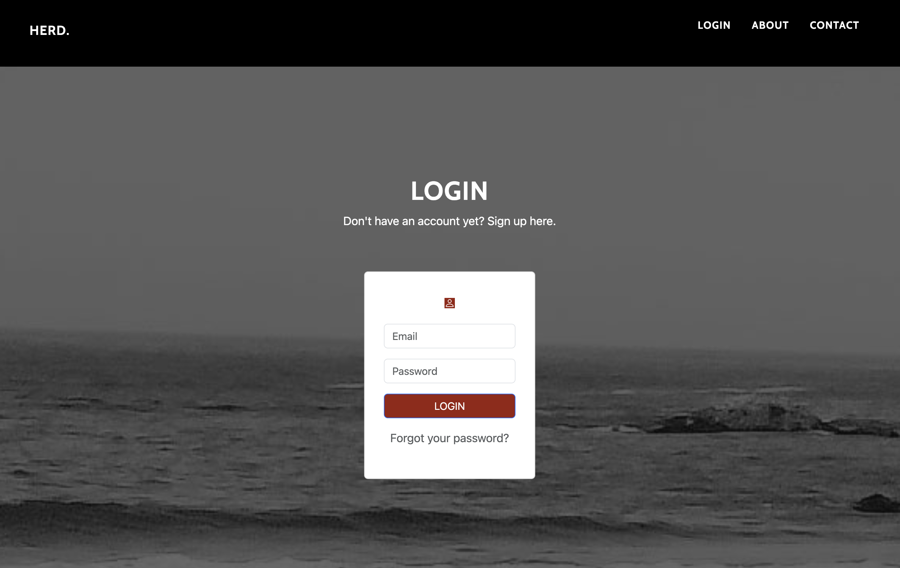

# cattle-tracker
Track location of your live-stock.

     

## Table of Contents

- [Description](#decription)
- [Learning Moments](#learning-moments)
- [Future Development](#future-development)
- [Built With](#built-with)
- [Installation](#installation)
- [Usage](#usage)
- [License](#license)
- [Contributors](#Contributors)
- [Credits](#credits)

## Decription

- HERD. is a livestock tracking software that allows the modern rancher to add & collect data on their livestock including location, parents and vaccination status. HERD. is devoted taking agriculture into the 21st century and works alongside clients to deliver a fully customized application. 

- Users will be able to add and track their live-stock within a database (Vaccine, tagID, last known location, parentID, age, known illneness, notes) conviently displayed on a dashboard page. 

- The agricultural industry has relied on generationally passed knowledge for financial success. HERD. will incorporate a rancher’s intuition with scalable data to continue to support America’s farmers. Rancher’s can track and analyze livestock for optimal results financially and for the health of the animal.

## Learning Moments
- Connecting Routes was a challenge that our team faced head on. It was a collaborative effort to continue to problem solve. 
- Use of Partials was another new trial and error that allowed us to get some practice and learn from eachother. 
- Lodash was a new addition that we implemented into our application, one of many npm packages that we looked at to try out during this deployment. 
- Deploying to heroku was a newer process that we have only done a handful of times up to now. 

## Future Development
Live Tracking Feature
    - Scan barcode on cattle and link to tagID in cattle database
    - Connect web application to live GPS tracker data from each cow
    - Display cattle location on map
    - Set boundaries and get notified if cattle escapes property

Biometric Data Tracking
    - Collect temperature, heart rate, and other measures to indicate health
    - Cattle movement and velocity to understand physical activity

Multiple Users on One Ranch
    - Currently, only one user can access the data of one ranch
    - We will add a feature that allows multiple ranchers to access the same ranch database

## Built With

- Node.js, 
- Express.js to create a RESTful API. 
- Handlebars.js
- []
- Sequelize ORM
- Heroku
- CSS
- []
- Lodash

## Installation

Below are some steps to install and setup HERD.

- Clone the repository at https://github.com/malxxy/cattle-tracker
- Install NPM Packages
- Install dependencies
- Run Seeds
- Start Server 

## Usage

- As government and private organizations continue to increase observation of livestock markets, its increasingly more important that farmers modernize their approach to tracking and data. HERD. allows farmers to login, add and track data on their animals. 

## License

Distributed under the MIT License. See LICENSE.txt for more information.

## How to Contribute

As UC Berkeley students and tech professional, we want to learn and continue to create. Please feel free to contribute your ideas and code by reaching out to the collaborators or follow the steps below to submit a pull request for approval. 

    1. Fork our Repo
    2. Create your Branch (git checkout -b )
    3. Make your own Adjustments 
    4. Commit your changes (git commit -m "")  
    5. Push to the branch 
    6. Open a pull request on GitHub

## Contributors

- Joshua Augsburger | Github @jaugsbu2
- Lexi Scott | Github @lexi-scott
- Maislinn Helfer | Github @maislinn
- Malia Yraguen | Github @malxxy

## Credits
- UC Berkeley Extension 2023

